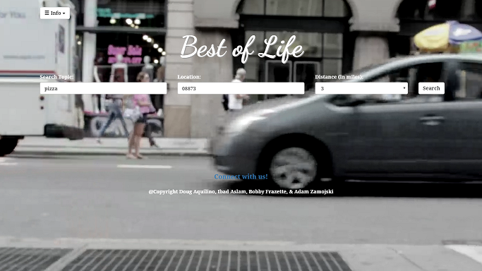
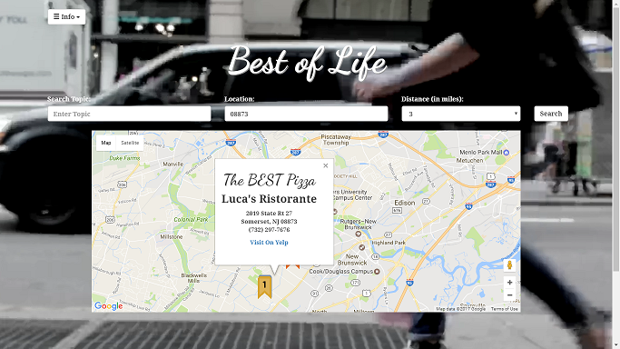

# Best of Life

The "Best of Life" is a tool anyone can use to find the "Best of" a search topic within a radius of a given location.

## Screenshots



## Technologies used
You can give a brief listing of the technologies you've learned and applied here

- google fonts 
- trello 
- coverr 
- slack 
- github 
- heroku 
- powerpoint 
- Yelp Fusion API 
- Google Maps API

## Getting Started

- Visit deployed site at https://calm-stream-84659.herokuapp.com/#

- If you want to see out code clone this repo at https://github.com/ajzamojski/Project-1.

### Prerequisities

Internet connection, web browser.


## Built With

* Sublime Text
* HTML 
* CSS 
* jQuery 
* ajax 
* javascript 
* php 
* bootstrap 

## Walk throughs of code
For Project presentation, you can include snippets of code you found buggy, interesting, or are overall proud of here.  Try to limit the quantity and size to quick readable bits.

You can also show where you've used technologies you've learned and applied here.

```
function awesomeThing() {
    //...
    // try not to make it too long otherwise, point to filepaths:line numbers
    //...
}
```

## Authors

* **John Doe** - *Initial work* - [John Doe](https://github.com)

See also the list of [contributors](https://github.com/your/project/contributors) who participated in this project.

## License

This project is licensed under the MIT License - see the [LICENSE.md](LICENSE.md) file for details

